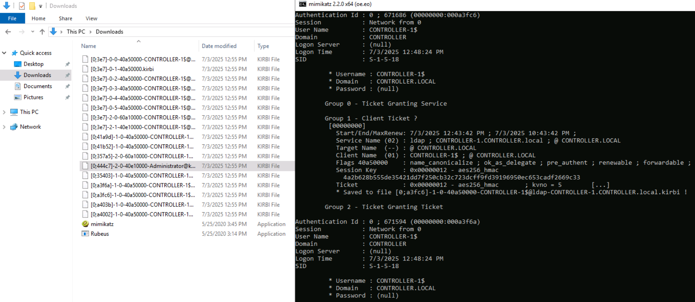

# Active Directory Basics

<div align="left"><figure><figcaption><p>tryhackme.com - © TryHackMe</p></figcaption></figure></div>

🔗 [Active Directory Basics](https://tryhackme.com/r/room/winadbasics)

### Task 1 - Introduction and deploy

🎯 Target IP: `10.10.97.33`

We start lab and spawn Windows Server machine. After we'll spawn an attacker box machine directly on THM (available in the free version).

<figure><figcaption></figcaption></figure>

### Task 2 - Windows Domains

<div align="left"><figure><figcaption></figcaption></figure></div>

<figure><figcaption></figcaption></figure>

### 2.1 - In a Windows domain, credentials are stored in a centralised repository called...

To overcome these limitations, we can use a Windows domain. Simply put, a **Windows domain** is a group of users and computers under the administration of a given business. The main idea behind a domain is to centralise the administration of common components of a Windows computer network in a single repository called **Active Directory (AD)**.&#x20;


Active Directory


### 2.2 - The server in charge of running the Active Directory services is called...

The server that runs the Active Directory services is known as a **Domain Controller (DC)**.


Domain Controller


## Task 3  - Active Directory

### 3.1 - Which group normally administrates all computers and resources in a domain?

| Security Group     | Description                                                                                                                                               |
| ------------------ | --------------------------------------------------------------------------------------------------------------------------------------------------------- |
| Domain Admins      | Users of this group have administrative privileges over the entire domain. By default, they can administer any computer on the domain, including the DCs. |
| Server Operators   | Users in this group can administer Domain Controllers. They cannot change any administrative group memberships.                                           |
| Backup Operators   | Users in this group are allowed to access any file, ignoring their permissions. They are used to perform backups of data on computers.                    |
| Account Operators  | Users in this group can create or modify other accounts in the domain.                                                                                    |
| Domain Users       | Includes all existing user accounts in the domain.                                                                                                        |
| Domain Computers   | Includes all existing computers in the domain.                                                                                                            |
| Domain Controllers | Includes all existing DCs on the domain.                                                                                                                  |


Domain Admin


### 3.2 - What would be the name of the machine account associated with a machine named TOM-PC?

Identifying machine accounts is relatively easy. They follow a specific naming scheme. The machine account name is the computer's name followed by a dollar sign. For example, a machine named `DC01` will have a machine account called `DC01$`.


TOM-PC$


### 3.3 - Suppose our company creates a new department for Quality Assurance. What type of containers should we use to group all Quality Assurance users so that policies can be applied consistently to them?

**Security Groups vs OUs**

You are probably wondering why we have both groups and OUs. While both are used to classify users and computers, their purposes are entirely different:

* **OUs** are handy for applying policies to users and computers, which include specific configurations that pertain to sets of users depending on their particular role in the enterprise. Remember, a user can only be a member of a single OU at a time, as it wouldn't make sense to try to apply two different sets of policies to a single user.
* **Security Groups**, on the other hand, are used to grant permissions over resources. For example, you will use groups if you want to allow some users to access a shared folder or network printer. A user can be a part of many groups, which is needed to grant access to multiple resources.


Organizational Unit


## Task 4  - Managing Users in AD

**Deleting extra OUs and users**

Your first task as the new domain administrator is to check the existing AD OUs and users, as some recent changes have happened to the business. You have been given the following organisational chart and are expected to make changes to the AD to match it:

<figure><figcaption></figcaption></figure>

**Delegation**

One of the nice things you can do in AD is to give specific users some control over some OUs. This process is known as **delegation** and allows you to grant users specific privileges to perform advanced tasks on OUs without needing a Domain Administrator to step in.

One of the most common use cases for this is granting `IT support` the privileges to reset other low-privilege users' passwords. According to our organisational chart, Phillip is in charge of IT support, so we'd probably want to delegate the control of resetting passwords over the Sales, Marketing and Management OUs to him.

<figure><figcaption></figcaption></figure>

Now let's use Phillip's account to try and reset Sophie's password. Here are Phillip's credentials for you to log in via RDP:

<figure><figcaption></figcaption></figure>

We can use xfreerdp to connect via RDP, or use directly the attacker box of THM changing account:

<div align="left"><figure><figcaption></figcaption></figure></div>

<figure><figcaption></figcaption></figure>

Now, using the newest task delegation of Phillip, we can change directly the password about others user, in this case for Sophie.

```powershell
Set-ADAccountPassword sophie -Reset -NewPassword (Read-Host -AsSecureString -Prompt 'New Password') -Verbose
```

### 4.1 - What was the flag found on Sophie's desktop?

To access to Sophie's desktop, we need to connect (using the newest password) using xfreerdp or win rdp on the attacker box and read flag.txt on desktop.

<figure><figcaption></figcaption></figure>


<figure><figcaption></figcaption></figure>


THM{thanks\_for\_contacting\_support}


### 4.2 - The process of granting privileges to a user over some OU or other AD Object is called...

<figure><figcaption></figcaption></figure>


delegation


## Task 5  - Managing Computers in AD

By default, all the machines that join a domain (except for the DCs) will be put in the container called "Computers". If we check our DC, we will see that some devices are already there:

<figure><figcaption></figcaption></figure>

While there is no golden rule on how to organise your machines, an excellent starting point is segregating devices according to their use. In general, you'd expect to see devices divided into at least the three following categories:

**1. Workstations**

Workstations are one of the most common devices within an Active Directory domain. Each user in the domain will likely be logging into a workstation. This is the device they will use to do their work or normal browsing activities. These devices should never have a privileged user signed into them.\


**2. Servers**

Servers are the second most common device within an Active Directory domain. Servers are generally used to provide services to users or other servers.

**3. Domain Controllers**

Domain Controllers are the third most common device within an Active Directory domain. Domain Controllers allow you to manage the Active Directory Domain. These devices are often deemed the most sensitive devices within the network as they contain hashed passwords for all user accounts within the environment.

Since we are tidying up our AD, let's create two separate OUs for `Workstations` and `Servers` (Domain Controllers are already in an OU created by Windows). We will be creating them directly under the `thm.local` domain container.

### 5.1 - After organising the available computers, how many ended up in the Workstations OU?

We need to create two OUs: workstations and servers:

<div align="left"><figure><figcaption></figcaption></figure></div>

and move LPTs and PCs to Workstations, while SRV to Servers.

<figure><figcaption></figcaption></figure>

<figure><figcaption></figcaption></figure>

<figure><figcaption></figcaption></figure>


7


### 5.2 - Is it recommendable to create separate OUs for Servers and Workstations? (yay/nay)

While there is no golden rule on how to organise your machines, an excellent starting point is segregating devices according to their use. In general, you'd expect to see devices divided into at least the three following categories:

**1. Workstations**

Workstations are one of the most common devices within an Active Directory domain. Each user in the domain will likely be logging into a workstation. This is the device they will use to do their work or normal browsing activities. These devices should never have a privileged user signed into them.\


**2. Servers**

Servers are the second most common device within an Active Directory domain. Servers are generally used to provide services to users or other servers.

**3. Domain Controllers**

Domain Controllers are the third most common device within an Active Directory domain. Domain Controllers allow you to manage the Active Directory Domain. These devices are often deemed the most sensitive devices within the network as they contain hashed passwords for all user accounts within the environment.


yay


## Task 6  - Group Policies

Windows manages such policies through **Group Policy Objects (GPO)**. GPOs are simply a collection of settings that can be applied to OUs. GPOs can contain policies aimed at either users or computers, allowing you to set a baseline on specific machines and identities.

<figure><figcaption></figcaption></figure>

<figure><figcaption></figcaption></figure>

and change the minimum password length to 10 chars.

<figure><figcaption></figcaption></figure>

#### GPO distribution

GPOs are distributed to the network via a network share called `SYSVOL`, which is stored in the DC. All users in a domain should typically have access to this share over the network to sync their GPOs periodically. The SYSVOL share points by default to the `C:\Windows\SYSVOL\sysvol\` directory on each of the DCs in our network.

Once a change has been made to any GPOs, it might take up to 2 hours for computers to catch up. If you want to force any particular computer to sync its GPOs immediately, you can always run the following command on the desired computer:

```powershell
gpupdate /force
```

<figure><figcaption></figcaption></figure>

#### Creating some GPOs for THM Inc.

As part of our new job, we have been tasked with implementing some GPOs to allow us to:

1. Block non-IT users from accessing the Control Panel.
2. Make workstations and servers lock their screen automatically after 5 minutes of user inactivity to avoid people leaving their sessions exposed.

Let's focus on each of those and define what policies we should enable in each GPO and where they should be linked.

_**Restrict Access to Control Panel**_

We want to restrict access to the Control Panel across all machines to only the users that are part of the IT department. Users of other departments shouldn't be able to change the system's preferences.

Let's create a new GPO called `Restrict Control Panel Access` and open it for editing. Since we want this GPO to apply to specific users, we will look under `User Configuration` for the following policy:

<figure><figcaption></figcaption></figure>

Notice we have enabled the **Prohibit Access to Control Panel and PC settings** policy.

Once the GPO is configured, we will need to link it to all of the OUs corresponding to users who shouldn't have access to the Control Panel of their PCs. In this case, we will link the `Marketing`, `Management` and `Sales` OUs by dragging the GPO to each of them

<figure><figcaption></figcaption></figure>

_**Auto Lock Screen GPO**_

For the first GPO, regarding screen locking for workstations and servers, we could directly apply it over the `Workstations`, `Servers` and `Domain Controllers` OUs we created previously.

While this solution should work, an alternative consists of simply applying the GPO to the root domain, as we want the GPO to affect all of our computers. Since the `Workstations`, `Servers` and `Domain Controllers` OUs are all child OUs of the root domain, they will inherit its policies.

**Note:** You might notice that if our GPO is applied to the root domain, it will also be inherited by other OUs like `Sales` or `Marketing`. Since these OUs contain users only, any Computer Configuration in our GPO will be ignored by them.

Let's create a new GPO, call it `Auto Lock Screen`, and edit it. The policy to achieve what we want is located in the following route:

<figure><figcaption></figcaption></figure>

We will set the inactivity limit to 5 minutes so that computers get locked automatically if any user leaves their session open. After closing the GPO editor, we will link the GPO to the root domain by dragging the GPO to it:


Once the GPOs have been applied to the correct OUs, we can log in as any users in either Marketing, Sales or Management for verification. For this task, let's connect via RDP using Mark's credentials:

<figure><figcaption></figcaption></figure>


### 6.1 -  What is the name of the network share used to distribute GPOs to domain machines?

GPOs are distributed to the network via a network share called `SYSVOL`, which is stored in the DC. All users in a domain should typically have access to this share over the network to sync their GPOs periodically. The SYSVOL share points by default to the `C:\Windows\SYSVOL\sysvol\` directory on each of the DCs in our network.


sysvol


### 6.2 - Can a GPO be used to apply settings to users and computers? (yay/nay)


yay


## Task 7 - Authentication Methods

When using Windows domains, all credentials are stored in the Domain Controllers. Whenever a user tries to authenticate to a service using domain credentials, the service will need to ask the Domain Controller to verify if they are correct. Two protocols can be used for network authentication in windows domains:

* Kerberos: Used by any recent version of Windows. This is the default protocol in any recent domain.
* NetNTLM: Legacy authentication protocol kept for compatibility purposes.

While NetNTLM should be considered obsolete, most networks will have both protocols enabled. Let's take a deeper look at how each of these protocols works.

Kerberos Authentication

Kerberos authentication is the default authentication protocol for any recent version of Windows. Users who log into a service using Kerberos will be assigned tickets. Think of tickets as proof of a previous authentication. Users with tickets can present them to a service to demonstrate they have already authenticated into the network before and are therefore enabled to use it.

When Kerberos is used for authentication, the following process happens:

1.  The user sends their username and a timestamp encrypted using a key derived from their password to the **Key Distribution Center (KDC)**, a service usually installed on the Domain Controller in charge of creating Kerberos tickets on the network.

    The KDC will create and send back a **Ticket Granting Ticket (TGT)**, which will allow the user to request additional tickets to access specific services. The need for a ticket to get more tickets may sound a bit weird, but it allows users to request service tickets without passing their credentials every time they want to connect to a service. Along with the TGT, a **Session Key** is given to the user, which they will need to generate the following requests.

    Notice the TGT is encrypted using the **krbtgt** account's password hash, and therefore the user can't access its contents. It is essential to know that the encrypted TGT includes a copy of the Session Key as part of its contents, and the KDC has no need to store the Session Key as it can recover a copy by decrypting the TGT if needed.
2.

    
3.  When a user wants to connect to a service on the network like a share, website or database, they will use their TGT to ask the KDC for a **Ticket Granting Service (TGS)**. TGS are tickets that allow connection only to the specific service they were created for. To request a TGS, the user will send their username and a timestamp encrypted using the Session Key, along with the TGT and a **Service Principal Name (SPN),** which indicates the service and server name we intend to access.

    As a result, the KDC will send us a TGS along with a **Service Session Key**, which we will need to authenticate to the service we want to access. The TGS is encrypted using a key derived from the **Service Owner Hash**. The Service Owner is the user or machine account that the service runs under. The TGS contains a copy of the Service Session Key on its encrypted contents so that the Service Owner can access it by decrypting the TGS.
4.

    
5. The TGS can then be sent to the desired service to authenticate and establish a connection. The service will use its configured account's password hash to decrypt the TGS and validate the Service Session Key.


NetNTLM Authentication

NetNTLM works using a challenge-response mechanism. The entire process is as follows:


1. The client sends an authentication request to the server they want to access.
2. The server generates a random number and sends it as a challenge to the client.
3. The client combines their NTLM password hash with the challenge (and other known data) to generate a response to the challenge and sends it back to the server for verification.
4. The server forwards the challenge and the response to the Domain Controller for verification.
5. The domain controller uses the challenge to recalculate the response and compares it to the original response sent by the client. If they both match, the client is authenticated; otherwise, access is denied. The authentication result is sent back to the server.
6. The server forwards the authentication result to the client.

Note that the user's password (or hash) is never transmitted through the network for security.

### 7.1 - Will a current version of Windows use NetNTLM as the preferred authentication protocol by default? (yay/nay)


nay


### 7.2 - When referring to Kerberos, what type of ticket allows us to request further tickets known as TGS?


Ticket Granting Ticket


### 7.3 - When using NetNTLM, is a user's password transmitted over the network at any point? (yay/nay)


nay


## Task 8 - Trees, Forests and Trusts

So far, we have discussed how to manage a single domain, the role of a Domain Controller and how it joins computers, servers and users.


As companies grow, so do their networks. Having a single domain for a company is good enough to start, but in time some additional needs might push you into having more than one.

#### Trees

Imagine, for example, that suddenly your company expands to a new country. The new country has different laws and regulations that require you to update your GPOs to comply. In addition, you now have IT people in both countries, and each IT team needs to manage the resources that correspond to each country without interfering with the other team. While you could create a complex OU structure and use delegations to achieve this, having a huge AD structure might be hard to manage and prone to human errors.

Luckily for us, Active Directory supports integrating multiple domains so that you can partition your network into units that can be managed independently. If you have two domains that share the same namespace (`thm.local` in our example), those domains can be joined into a **Tree**.

If our `thm.local` domain was split into two subdomains for UK and US branches, you could build a tree with a root domain of `thm.local` and two subdomains called `uk.thm.local` and `us.thm.local`, each with its AD, computers and users:


This partitioned structure gives us better control over who can access what in the domain. The IT people from the UK will have their own DC that manages the UK resources only. For example, a UK user would not be able to manage US users. In that way, the Domain Administrators of each branch will have complete control over their respective DCs, but not other branches' DCs. Policies can also be configured independently for each domain in the tree.

A new security group needs to be introduced when talking about trees and forests. The Enterprise Admins group will grant a user administrative privileges over all of an enterprise's domains. Each domain would still have its Domain Admins with administrator privileges over their single domains and the Enterprise Admins who can control everything in the enterprise.\


#### Forests

The domains you manage can also be configured in different namespaces. Suppose your company continues growing and eventually acquires another company called `MHT Inc.` When both companies merge, you will probably have different domain trees for each company, each managed by its own IT department. The union of several trees with different namespaces into the same network is known as a **forest**.


#### Trust Relationships

Having multiple domains organised in trees and forest allows you to have a nice compartmentalised network in terms of management and resources. But at a certain point, a user at THM UK might need to access a shared file in one of MHT ASIA servers. For this to happen, domains arranged in trees and forests are joined together by **trust relationships**.

In simple terms, having a trust relationship between domains allows you to authorise a user from domain `THM UK` to access resources from domain `MHT EU`.

The simplest trust relationship that can be established is a **one-way trust relationship**. In a one-way trust, if `Domain AAA` trusts `Domain BBB`, this means that a user on BBB can be authorised to access resources on AAA:


The direction of the one-way trust relationship is contrary to that of the access direction.

**Two-way trust relationships** can also be made to allow both domains to mutually authorise users from the other. By default, joining several domains under a tree or a forest will form a two-way trust relationship.

It is important to note that having a trust relationship between domains doesn't automatically grant access to all resources on other domains. Once a trust relationship is established, you have the chance to authorise users across different domains, but it's up to you what is actually authorised or not.

### 8.1 -  What is a group of Windows domains that share the same namespace called?


Tree


### 8.2 - What should be configured between two domains for a user in Domain A to access a resource in Domain B?


A Trust Relationship


<figure><figcaption></figcaption></figure>
